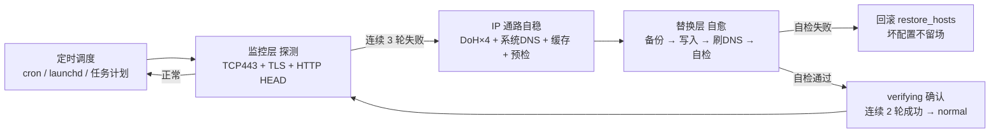

<div align="center">
  
  <h1>ghlink — GitHub 链路自愈工具</h1>
  <p>当 GitHub 网络不稳定时，自动获取可用 IP 并替换 hosts，实现无感自愈。</p>
</div>

<p align="center">
  <a href="https://github.com/liwmj/ghlink/actions/workflows/ci.yml"></a>
  <a href="https://github.com/liwmj/ghlink/releases"></a>
  <a href="LICENSE"></a>
  <a href="docs/DESIGN.md"></a>
  <a href="docs/"></a>
  <a href="https://github.com/liwmj/ghlink/releases"></a>
</p>

---

## 目录

- [为什么需要 ghlink](#为什么需要-ghlink)
- [核心特性](#核心特性)
- [工作原理](#工作原理)
- [架构设计](#架构设计)
- [快速开始](#快速开始)
- [配置说明](#配置说明)
- [运行与退出码](#运行与退出码)
- [状态文件](#状态文件)
- [测试与验证](#测试与验证)
- [跨平台支持](#跨平台支持)
- [路线图](#路线图)
- [开发记录](#开发记录)
- [License](#license)

---

## 为什么需要 ghlink

在中国大陆等网络环境下，GitHub 的 DNS 解析经常被污染或返回不可达 IP，导致 `git clone`、`git push`、网页访问频繁超时（TCP 443 连接失败、TLS 握手超时）。

常见的解决方式：
- **手动改 hosts**：需要人工找 IP、改文件、刷 DNS，IP 失效后又要重来
- **代理工具**：需要额外部署、配置，且不是所有场景都适用

**ghlink 的思路**：监控 GitHub 连通性 → 不稳定时自动获取可用 IP → 写入 hosts → 自检确认 → 失败自动回滚，全程无人工干预。

---

## 核心特性

- 🔍 **三层探测**：TCP 443 建连 → TLS 握手（SNI）→ HTTP HEAD，真实反映 GitHub 可用性
- 🔄 **自动自愈**：连续 3 轮失败（默认）触发切换，写入新 IP 后自检，失败立即回滚
- 🌐 **多源 IP 获取**：阿里/腾讯/Cloudflare/Google 四个 DoH 源 + 系统 DNS + 本地缓存 + GitHub520 社区列表，多数票 + TCP 443 预检，单源故障自动剔除；**动态解析失败自动回退 GitHub520 静态列表**（v0.4.0：首装全量写，预检过排前）
- 🧠 **目标域名健康度管理**（v0.2 + v0.4.0）：非核心域名（如 codeload/fastly）长期不可达自动降级——**降级不从 hosts 删除，改用 GitHub520 静态 IP 兜底**（v0.4.0 李工定），动态恢复后自动重新纳入；核心域名（github.com / api.github.com）永不降级优先保证切换成功
- 🛡️ **安全红线**：写入前备份 hosts、写入后自检、自检失败回滚——**宁可不变，不能改坏**
- ⏱️ **冷却防抖**：切换成功后 15 分钟冷却期，避免 IP 抖动导致频繁切换
- 🧵 **防重入锁**：跨平台（flock / msvcrt / PID 文件），避免定时任务并发执行
- 🔔 **飞书告警**：切换、降级、回滚事件实时通知（飞书 Webhook 已实现；钉钉 / 企业微信 / Telegram / 通用 Webhook 规划中），冷却期去重，发送失败不阻断主流程
- 💻 **跨平台**：macOS / Windows / Linux 一套代码，平台差异收敛到单一适配层
- 📦 **零第三方依赖**：纯 Python 标准库实现，运行无需任何第三方包

---

## 工作原理



**状态机**：`normal → switching → verifying → normal`，异常路径进入 `degraded`。

**v0.4.0 降级语义（李工 2026-08-22 定）**：动态解析失败但有 GitHub520 静态兜底 → **仍写静态段**（首装/断网场景 hosts 必有可用条目）；动态失败且无任何兜底候选 → 才不写、保持系统默认 DNS（宁缺毋滥，只告警不破坏）。

---

## 架构设计

详细设计文档见 [docs/DESIGN.md](docs/DESIGN.md)，包含：

- 模块划分与职责（9 个核心模块）
- 平台差异适配策略（hosts 路径 / 提权 / DNS 刷新）
- 状态文件 Schema v1
- 失败场景与降级路径
- 代码审查记录：[docs/REVIEW-v0.1.md](docs/REVIEW-v0.1.md)

```
src/ghlink/
├── config.py            # 配置加载 / 深合并 / 缺省回退
├── platform_adapter.py  # 平台差异唯一出口（hosts / 权限 / 刷DNS / 备份回滚）
├── probe.py             # TCP443 + TLS + HTTP HEAD 三层探测
├── resolver.py          # 多 DoH + 系统 DNS 多数票 + 443 预检 + 缓存兜底
├── hosts_manager.py     # 段落式写入 / 备份 / 自检 / 回滚
├── state.py             # 状态文件原子写
├── notifier.py          # 飞书通知（Webhook，冷却去重，失败不阻断；多渠道规划中）
├── lock.py              # 跨平台防重入锁（flock / msvcrt / PID 文件）
└── main.py              # 单轮执行闭环（探测→判定→自愈→确认）
```

---

## 默认行为（值守独立于托盘，2026-08-17 李工新口径）

ghlink 的语义模型（替代 2026-08-16 版「托盘=值守总开关」）：

- **值守独立于托盘**：`ghlink enable` 注册平台定时任务（1 分钟粒度后台探测 + 自愈）即开启值守，**不启动托盘也能值守**（命令行模式）。
- **托盘 = UI 载体**：托盘用于展示状态（图标颜色/菜单）与便捷操作（复制 IP/开关自启）。启动/退出托盘不改变值守状态，值守由 enable 独立管理。
- **Windows 便捷联动**（启动逻辑层面，非代码逻辑）：为方便 Windows 用户，启动托盘时同步启动值守；退出托盘时同步退出值守。Windows 托盘在 ⇒ 值守在（联动行为）；命令行 `ghlink enable` 仍可独立值守。
- **值守 enable**：底层是系统定时任务（Windows schtasks / macOS LaunchDaemon / Linux systemd timer，1 分钟粒度），`ghlink enable` 注册、`ghlink disable` 移除、`ghlink status` 查看。

关键语义：**值守在 = 平台任务注册 + 心跳正常**；托盘只是显示器，不是开关。安装后默认不自启（需手动 `ghlink enable` 或勾选「开机自动启动托盘」）。

## 快速开始

### 环境要求

- Python 3.8+（纯标准库，无第三方依赖）
- 写 hosts 需要管理员/root 权限

### 安装（各系统）

**macOS（Homebrew Cask，推荐）**

```bash
# 方式一：信任 tap 后安装（Homebrew 4.x 起第三方 tap 默认不可信，必须先 trust）
brew tap liwmj/tap
brew trust liwmj/tap
brew install --cask ghlink

# 方式二：若已 tap 但报 Refusing to load ... untrusted tap
brew trust liwmj/tap && brew install --cask ghlink
```

> tap 仓库：liwmj/homebrew-tap（2026-08-23 由 homebrew-ghlink 更名，多包通用 tap）
> v0.4.12 起 cask 单轨（formula 已 deprecate）：安装为 /Applications/ghlink.app（托盘 GUI + 内嵌 CLI symlink /usr/local/bin/ghlink），卸载用 brew uninstall --cask ghlink 彻底清理

**Windows（安装向导 / 裸 exe）**

```bash
# 方式一：安装向导（推荐，含托盘依赖与开机自启选项）
# 从 https://github.com/liwmj/ghlink/releases 下载 ghlink-installer-vX.Y.Z.exe 双击安装

# 方式二：裸 exe（绿色版，无需安装）
# 下载 ghlink.exe（CLI）+ ghlink-tray.exe（托盘）放同一目录直接运行
```

**Linux（apt / .deb）**

```bash
# 方式一：apt 仓库（Debian/Ubuntu，v0.2.18 起用 Pages 固定 URL，写一次永久生效）
echo "deb [trusted=yes] https://liwmj.github.io/ghlink/apt/ ./" | sudo tee /etc/apt/sources.list.d/ghlink.list
sudo apt update && sudo apt install ghlink
# 以后每版发完直接 sudo apt upgrade 拿最新，无需改 sources.list

# 方式二：.deb 直接安装
wget https://github.com/liwmj/ghlink/releases/download/v0.2.18/ghlink_0.2.18-1_all.deb
sudo dpkg -i ghlink_*.deb
```

**PyPI（任意系统，发布打通后生效）**

```bash
# PyPI 发布打通后可直接安装（当前版本请优先使用上方各平台安装包）
pip install ghlink
```

**源码（任意系统，零第三方依赖）**

```bash
git clone https://github.com/liwmj/ghlink.git && cd ghlink
cp config.example.json config.json
# 运行：python3 -m ghlink.main run [config.json]
# 托盘：pip install pystray Pillow 后 python3 -m ghlink.main tray
```

### 配置

```bash
cp config.example.json config.json
# 编辑 config.json：
#   - notify.feishu_webhook：飞书群机器人 Webhook 地址（配置后启用告警，空=关闭）
#   - notify.enabled：告警开关（默认 true）
#   - probe.targets：探测域名清单（默认 github.com / api.github.com 等）
# 注：钉钉 / 企业微信 / Telegram / 通用 Webhook 等渠道规划中，后续版本支持
```

### 手动运行一次

```bash
# Linux / macOS（需 root 写 hosts）
sudo python3 -m ghlink.main config.json

# Windows（管理员命令行）
python -m ghlink.main config.json
```

退出码 `0` = 正常（探测通过或冷却期跳过），`1` = 降级/告警。

### 默认行为（v0.2.x）

- **安装后默认不自启**（2026-08-14 李工定规）：不注册值守任务、托盘不随登录启动
- **开启自启**：托盘右键菜单「启用值守」开关，或命令行 `ghlink enable`（注册 1 小时粒度定时任务，v0.2.18 起）
- **关闭自启**：托盘右键「停用值守」，或 `ghlink disable`
- 托盘（Windows/macOS）：状态图标/悬停摘要/右键开关/气泡通知；Linux 为纯 CLI

### 定时调度（1 小时粒度，v0.2.18 起）

**Linux（crontab）**：
```bash
0 * * * * cd /opt/ghlink && sudo python3 -m ghlink.main config.json >> /var/log/ghlink.log 2>&1
```

**macOS（launchd）**：
```xml
<?xml version="1.0" encoding="UTF-8"?>
<!DOCTYPE plist PUBLIC "-//Apple//DTD PLIST 1.0//EN" "http://www.apple.com/DTDs/PropertyList-1.0.dtd">
<plist version="1.0">
<dict>
    <key>Label</key><string>com.ghlink.daemon</string>
    <key>ProgramArguments</key>
    <array>
        <string>/usr/bin/python3</string>
        <string>/opt/ghlink/src/ghlink/main.py</string>
        <string>/opt/ghlink/config.json</string>
    </array>
    <key>StartInterval</key><integer>3600</integer>
    <key>RunAtLoad</key><true/>
</dict>
</plist>
```

**Windows（任务计划程序）**：创建基本任务 → 触发器设为「重复任务间隔 1 小时」→ 操作设为 `python C:\ghlink\src\ghlink\main.py C:\ghlink\config.json`，勾选「使用最高权限运行」。

### GitHub520 社区 IP 集成（v0.2.18 + v0.4.0）

ghlink 周期拉取 [GitHub520](https://github.com/521xueweihan/GitHub520) 社区 hosts（默认 1 小时刷新），为非核心 GitHub 域名（raw/objects/gist 等）补充社区 IP，覆盖自愈盲区。

**v0.4.0 语义（李工 2026-08-22 三点定）**：
- **首装全量写**：enable/首次 run 初始化时写入 GitHub520 全量 IP（含核心域名静态兜底，预检过的排前——hosts 取首个命中），后续轮次才走动态优化
- **降级用静态 IP 兜底不删除**：非核心域名动态降级后保留 GitHub520 静态段，动态恢复自动加回
- **动态失败仍写静态段**：DoH 全源失败但有 GitHub520 兜底时照写，不再空手 degraded
- **内置快照兜底**：拉取失败且缓存空时用内置最新快照（首装断网也能直接用）
- 写入前 TCP 可达性抽检防坏 IP 入场；拉取失败自动回退本地缓存 → 内置快照

**hosts 段落管理（v0.4.0，李工 12:35 点 3）**：
- ghlink 全部修改收敛在独立段落 `# ghlink Start/End`（含 `# ghlink520` 子段），段落外内容零改动，不影响用户其他 DNS 配置
- **段落插到 hosts 文件最前**（first-match-wins 优先命中），避免用户预存条目在段落前遮蔽 ghlink 写入
- **预存条目冲突检测**：enable 时扫描段落外 GitHub 生态域名预存条目 → 命中则告警 + 自动备份原 hosts（hosts_backup_dir），用户记录不动
- **卸载即恢复**：卸载/disable 移除 ghlink 段落即恢复原状（备份可回滚）

---

## 配置说明

| 配置段 | 字段 | 默认值 | 说明 |
|--------|------|--------|------|
| `probe` | `targets` | github.com 等 8 域名 | 探测域名清单（v0.2.18 扩域：含 raw/objects/gist/githubassets） |
| `probe` | `timeout_sec` | 15 | 单域名探测超时 |
| `probe` | `core_targets` | github.com / api.github.com | 核心域名（永不降级，优先保证切换成功） |
| `probe` | `degrade_after_rounds` | 3 | 非核心域名连续失败 N 轮 → 降级（1h 粒度 ≈ 3h） |
| `probe` | `recover_rounds` | 2 | 降级域名连续成功 N 轮 → 恢复纳入 |
| `trigger` | `consecutive_failures` | 3 | 连续失败 N 轮触发切换（1h 粒度 ≈ 3h） |
| `trigger` | `cooldown_min` | 180 | 切换后冷却分钟数（1h 粒度核算） |
| `trigger` | `verify_success_rounds` | 2 | 自愈后连续成功轮数恢复 normal |
| `github520` | `enabled` | true | GitHub520 社区 IP 集成开关（v0.2.18） |
| `github520` | `url` | raw.hellogithub.com/hosts | 社区 hosts 拉取源 |
| `github520` | `refresh_min` | 60 | 社区 IP 刷新周期（1 小时） |
| `github520` | `core_first` | true | 核心域名 ghlink 自愈优先（v0.4.0：首装含核心域名静态兜底，动态成功时动态段优先） |
| `resolver` | `doh_sources` | 阿里/腾讯/CF/Google | DoH 源 URL 列表 |
| `resolver` | `cache_ttl_sec` | 3600 | 本地 IP 缓存有效期 |
| `resolver` | `max_candidates` | 5 | 候选 IP 上限 |
| `notify` | `feishu_webhook` | 空 | 飞书群机器人 Webhook 地址（配置后启用告警；钉钉/企微/Telegram/通用 Webhook 规划中） |
| `notify` | `enabled` | true | 告警开关 |

---

## 运行与退出码

| 码 | 含义 |
|----|------|
| 0 | 正常（探测通过 / 锁占用跳过 / 冷却期跳过 / 切换成功） |
| 1 | 降级（提权失败 / 写入失败 / 自检失败回滚 / 无可用 IP / 告警触发） |
| 2 | 配置 / 参数错误 |

**降级语义（v0.4.0）**：动态失败但有 GitHub520 静态兜底 → 写静态段（首装/断网可用）；无任何可用候选才不写——任何写入都经 TCP 预检，自检不过立即回滚，只记录状态并可选告警。

---

## 状态文件

默认 `ghlink_status.json`（schema v1）：

```json
{
  "schema_version": 1,
  "state": "normal",
  "probe": {
    "targets": { "github.com": {"ok": true} },
    "consecutive_failures": 0
  },
  "current_ip": "140.82.112.3",
  "verify_success": 0,
  "switched_at": null,
  "last_error": null,
  "history": []
}
```

| 状态 | 含义 |
|------|------|
| `normal` | 健康，无需干预 |
| `switching` | 已触发切换，正在写入 hosts |
| `verifying` | 已写入，等待连续成功确认 |
| `degraded` | 降级：保持原配置，已告警 |

---

## 测试与验证

- **单元/集成测试**：`tests/` 目录，60 个用例覆盖配置/探测/解析/hosts/状态/锁/通知/全链路/域名健康度
- **运行测试**：`python -m pytest tests/ -v`
- **真机冒烟**：已完成三平台验证（2026-08-14）：
  - Linux（Ubuntu）：注入故障 → 触发切换 → 写入 → 自检 → 回滚 → 锁接管 → 冷却防抖全链路通过
  - Windows（Server 2022）：正常路径无感跳过 / E-004 降级（全源不可达保持原配置）/ 注入 127.0.0.1 → 自动切换 20.205.243.168 / 2 轮确认恢复 / 残留锁接管 + 并发跳过
  - macOS：本机故障注入全链路冒烟（正常路径/切换/回滚/锁/冷却）通过
- **验证记录**：三平台（macOS / Windows / Linux）60 用例全绿 + 真机冒烟报告

---

## 跨平台支持

| 平台 | 单测 | 真机冒烟 | 备注 |
|------|------|----------|------|
| macOS 13+ | ✅ 60 passed | ✅ 已完成 (2026-08-14) | Intel / Apple Silicon |
| Windows 10/11 / Server | ✅ 60 passed | ✅ 已完成 (2026-08-13) | UAC 提权 / ipconfig flushdns |
| Linux (Ubuntu/Debian) | ✅ 60 passed | ✅ 已完成 | resolvectl / 备份恢复 |

---

## 路线图

- [x] **v0.1.0**（2026-08-13）：核心自愈闭环 + 三平台单测全绿 + 双平台真机冒烟
- [x] **v0.2.0**（2026-08-14）：目标域名健康度管理（长期不可达域名自动降级，核心域名优先切换）+ 三平台真机冒烟闭环 + 生产就绪（Production/Stable）
- [x] **v0.2.1**（2026-08-14）：默认不自启（李工定规）+ 平台安装包发布（Windows installer / macOS brew / Linux deb）
- [x] **v0.3.1**（2026-08-22）：deb 包内 Version 动态注入 + 版本号随 tag 同步（跟进人 Linux 回归发现修复）
- [x] **v0.4.0**（2026-08-22，李工 12:35 三点 + 12:44 终裁）：首装全量写 GitHub520 兜底（含核心域名静态 IP，预检过排前）+ 降级保留静态 IP 不删除 + 多源回退链（DoH→GitHub520→内置快照）+ hosts 块前移优先命中 + 预存条目检测告警
- [ ] **v0.4.x**：历史切换统计与报表

---

## 开发记录

- 2026-08-13：立项（PJ-002）→ 架构设计 → 核心 9 模块实现 → 代码审查（P0/P1/P2 全修复）→ 测试套件合入（51 用例全绿）→ 三平台验证（macOS/Linux/Windows 51 passed）→ Linux + Windows 真机冒烟完成 → Release v0.1.0
- 2026-08-13：Windows 真机冒烟完成，三平台矩阵全绿
- 2026-08-14：v0.2.0/v0.2.1 发布（目标域名健康度管理 + 默认不自启 + 多平台安装包）；三平台真机冒烟闭环
- 2026-08-15：按 P-006 v1.21 对齐（ruff 代码规范 + CI 门禁 + README 徽章参数化/mermaid 原理图 + 测试矩阵）
- 2026-08-22：v0.3.0 发布（4 位 tag 清理 + CI tag 3 位校验 + 三平台卸载删配置 + 内置 GitHub520 兜底）；v0.3.1 发布（deb Version 动态注入 + 版本号同步）；v0.4.0 开发（首装全量写兜底/降级保留静态 IP/hosts 块前移/多源回退链，李工 12:35 三点定调）
- 2026-08-22：分支治理（GitHub Flow 合并即删铁律入信息表 v1.23，清理 23 个历史分支 + 2 个 stale PR）
- 立项评估：A 级（优化 GitHub 网络链路，直接影响开发/同步效率与稳定性）

---

## Contributors

<!-- 早期手动头像墙，有外部贡献者后切换 all-contributors 自动化（P-006 v1.15） -->
<a href="https://github.com/liwmj"></a>

---

## License

[MIT](LICENSE)
