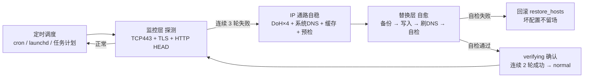

# ghlink — GitHub 链路自愈工具

> 当 GitHub 网络不稳定时，自动获取可用 IP 并替换 hosts，实现无感自愈。

<div align="center">

[](https://github.com/liwmj/ghlink/actions/workflows/ci.yml)
[](https://github.com/liwmj/ghlink/releases)
[](LICENSE)
[](docs/DESIGN.md)
[](docs/)
[](https://github.com/liwmj/ghlink/releases)

</div>

---

## 目录

- [为什么需要 ghlink](#为什么需要-ghlink)
- [核心特性](#核心特性)
- [工作原理](#工作原理)
- [架构设计](#架构设计)
- [快速开始](#快速开始)
- [配置说明](#配置说明)
- [运行与退出码](#运行与退出码)
- [状态文件](#状态文件)
- [测试与验证](#测试与验证)
- [跨平台支持](#跨平台支持)
- [路线图](#路线图)
- [开发记录](#开发记录)
- [License](#license)

---

## 为什么需要 ghlink

在中国大陆等网络环境下，GitHub 的 DNS 解析经常被污染或返回不可达 IP，导致 `git clone`、`git push`、网页访问频繁超时（TCP 443 连接失败、TLS 握手超时）。

常见的解决方式：
- **手动改 hosts**：需要人工找 IP、改文件、刷 DNS，IP 失效后又要重来
- **代理工具**：需要额外部署、配置，且不是所有场景都适用

**ghlink 的思路**：监控 GitHub 连通性 → 不稳定时自动获取可用 IP → 写入 hosts → 自检确认 → 失败自动回滚，全程无人工干预。

---

## 核心特性

- 🔍 **三层探测**：TCP 443 建连 → TLS 握手（SNI）→ HTTP HEAD，真实反映 GitHub 可用性
- 🔄 **自动自愈**：连续 3 轮失败（默认）触发切换，写入新 IP 后自检，失败立即回滚
- 🌐 **多源 IP 获取**：阿里/腾讯/Cloudflare/Google 四个 DoH 源 + 系统 DNS + 本地缓存，多数票 + TCP 443 预检，单源故障自动剔除
- 🧠 **目标域名健康度管理**（v0.2）：非核心域名（如 codeload/fastly）长期不可达自动降级，从判定/自检集剔除，核心域名（github.com / api.github.com）永不降级优先保证切换成功；恢复后自动重新纳入
- 🛡️ **安全红线**：写入前备份 hosts、写入后自检、自检失败回滚——**宁可不变，不能改坏**
- ⏱️ **冷却防抖**：切换成功后 15 分钟冷却期，避免 IP 抖动导致频繁切换
- 🧵 **防重入锁**：跨平台（flock / msvcrt / PID 文件），避免定时任务并发执行
- 🔔 **多渠道告警**：切换、降级、回滚事件实时通知（飞书 / 钉钉 / 企业微信 / Telegram / 通用 Webhook 可配），冷却期去重，发送失败不阻断主流程
- 💻 **跨平台**：macOS / Windows / Linux 一套代码，平台差异收敛到单一适配层
- 📦 **零第三方依赖**：纯 Python 标准库实现，`pip install` 都不需要

---

## 工作原理



**状态机**：`normal → switching → verifying → normal`，异常路径进入 `degraded`（只告警不破坏）。

---

## 架构设计

详细设计文档见 [docs/DESIGN.md](docs/DESIGN.md)，包含：

- 模块划分与职责（9 个核心模块）
- 平台差异适配策略（hosts 路径 / 提权 / DNS 刷新）
- 状态文件 Schema v1
- 失败场景与降级路径
- 代码审查记录：[docs/REVIEW-v0.1.md](docs/REVIEW-v0.1.md)

```
src/ghlink/
├── config.py            # 配置加载 / 深合并 / 缺省回退
├── platform_adapter.py  # 平台差异唯一出口（hosts / 权限 / 刷DNS / 备份回滚）
├── probe.py             # TCP443 + TLS + HTTP HEAD 三层探测
├── resolver.py          # 多 DoH + 系统 DNS 多数票 + 443 预检 + 缓存兜底
├── hosts_manager.py     # 段落式写入 / 备份 / 自检 / 回滚
├── state.py             # 状态文件原子写
├── notifier.py          # 多渠道通知（Webhook / 飞书 / 钉钉 / 企业微信等，冷却去重，失败不阻断）
├── lock.py              # 跨平台防重入锁（flock / msvcrt / PID 文件）
└── main.py              # 单轮执行闭环（探测→判定→自愈→确认）
```

---

## 快速开始

### 环境要求

- Python 3.8+（纯标准库，无第三方依赖）
- 写 hosts 需要管理员/root 权限

### 安装

```bash
# 方式一：从 Release 下载源码包（最新版）
curl -L https://github.com/liwmj/ghlink/archive/refs/tags/v0.2.1.tar.gz -o ghlink.tar.gz
tar xzf ghlink.tar.gz && cd ghlink-*

# 方式二：直接 clone（推荐，获取最新代码）
git clone https://github.com/liwmj/ghlink.git && cd ghlink
```

### 配置

```bash
cp config.example.json config.json
# 编辑 config.json：
#   - notify.channel：通知渠道（webhook / feishu / dingtalk / wecom / telegram，可选，默认关）
#   - probe.targets：探测域名清单（默认 github.com / api.github.com 等）
```

### 手动运行一次

```bash
# Linux / macOS（需 root 写 hosts）
sudo python3 -m ghlink.main config.json

# Windows（管理员命令行）
python -m ghlink.main config.json
```

退出码 `0` = 正常（探测通过或冷却期跳过），`1` = 降级/告警。

### 默认行为（v0.2.x）

- **安装后默认不自启**（2026-08-14 李工定规）：不注册值守任务、托盘不随登录启动
- **开启自启**：托盘右键菜单「启用值守」开关，或命令行 `ghlink enable`（注册 1 分钟粒度定时任务）
- **关闭自启**：托盘右键「停用值守」，或 `ghlink disable`
- 托盘（Windows/macOS）：状态图标/悬停摘要/右键开关/气泡通知；Linux 为纯 CLI

### 定时调度（1 分钟粒度）

**Linux（crontab）**：
```bash
* * * * * cd /opt/ghlink && sudo python3 -m ghlink.main config.json >> /var/log/ghlink.log 2>&1
```

**macOS（launchd）**：
```xml
<?xml version="1.0" encoding="UTF-8"?>
<!DOCTYPE plist PUBLIC "-//Apple//DTD PLIST 1.0//EN" "http://www.apple.com/DTDs/PropertyList-1.0.dtd">
<plist version="1.0">
<dict>
    <key>Label</key><string>com.ghlink.daemon</string>
    <key>ProgramArguments</key>
    <array>
        <string>/usr/bin/python3</string>
        <string>/opt/ghlink/src/ghlink/main.py</string>
        <string>/opt/ghlink/config.json</string>
    </array>
    <key>StartInterval</key><integer>60</integer>
    <key>RunAtLoad</key><true/>
</dict>
</plist>
```

**Windows（任务计划程序）**：创建基本任务 → 触发器设为「重复任务间隔 1 分钟」→ 操作设为 `python C:\ghlink\src\ghlink\main.py C:\ghlink\config.json`，勾选「使用最高权限运行」。

---

## 配置说明

| 配置段 | 字段 | 默认值 | 说明 |
|--------|------|--------|------|
| `probe` | `targets` | github.com 等 4 域名 | 探测域名清单 |
| `probe` | `timeout_sec` | 5 | 单域名探测超时 |
| `probe` | `core_targets` | github.com / api.github.com | 核心域名（永不降级，优先保证切换成功） |
| `probe` | `degrade_after_rounds` | 10 | 非核心域名连续失败 N 轮 → 降级（≈10min） |
| `probe` | `recover_rounds` | 2 | 降级域名连续成功 N 轮 → 恢复纳入 |
| `trigger` | `consecutive_failures` | 3 | 连续失败 N 轮触发切换 |
| `trigger` | `cooldown_min` | 15 | 切换后冷却分钟数 |
| `trigger` | `verify_success_rounds` | 2 | 自愈后连续成功轮数恢复 normal |
| `resolver` | `doh_sources` | 阿里/腾讯/CF/Google | DoH 源 URL 列表 |
| `resolver` | `cache_ttl_sec` | 3600 | 本地 IP 缓存有效期 |
| `resolver` | `max_candidates` | 5 | 候选 IP 上限 |
| `notify` | `channel` | 关 | 通知渠道（webhook / feishu / dingtalk / wecom / telegram） |
| `notify` | `webhook_url` | 空 | 通用 Webhook URL / 各渠道机器人地址（可选，配置后启用通知） |

---

## 运行与退出码

| 码 | 含义 |
|----|------|
| 0 | 正常（探测通过 / 锁占用跳过 / 冷却期跳过 / 切换成功） |
| 1 | 降级（提权失败 / 写入失败 / 自检失败回滚 / 无可用 IP / 告警触发） |
| 2 | 配置 / 参数错误 |

**降级语义**：任何失败都不破坏现有 hosts（要么不写，要么写了自检不过立即回滚），只记录状态并可选告警。

---

## 状态文件

默认 `ghlink_status.json`（schema v1）：

```json
{
  "schema_version": 1,
  "state": "normal",
  "probe": {
    "targets": { "github.com": {"ok": true} },
    "consecutive_failures": 0
  },
  "current_ip": "140.82.112.3",
  "verify_success": 0,
  "switched_at": null,
  "last_error": null,
  "history": []
}
```

| 状态 | 含义 |
|------|------|
| `normal` | 健康，无需干预 |
| `switching` | 已触发切换，正在写入 hosts |
| `verifying` | 已写入，等待连续成功确认 |
| `degraded` | 降级：保持原配置，已告警 |

---

## 测试与验证

- **单元/集成测试**：`tests/` 目录，60 个用例覆盖配置/探测/解析/hosts/状态/锁/通知/全链路/域名健康度
- **运行测试**：`python -m pytest tests/ -v`
- **真机冒烟**：已完成三平台验证（2026-08-14）：
  - Linux（Ubuntu）：注入故障 → 触发切换 → 写入 → 自检 → 回滚 → 锁接管 → 冷却防抖全链路通过
  - Windows（Server 2022）：正常路径无感跳过 / E-004 降级（全源不可达保持原配置）/ 注入 127.0.0.1 → 自动切换 20.205.243.168 / 2 轮确认恢复 / 残留锁接管 + 并发跳过
  - macOS：本机故障注入全链路冒烟（正常路径/切换/回滚/锁/冷却）通过
- **验证记录**：三平台（macOS / Windows / Linux）60 用例全绿 + 真机冒烟报告

---

## 跨平台支持

| 平台 | 单测 | 真机冒烟 | 备注 |
|------|------|----------|------|
| macOS 13+ | ✅ 60 passed | ✅ 已完成 (2026-08-14) | Intel / Apple Silicon |
| Windows 10/11 / Server | ✅ 60 passed | ✅ 已完成 (2026-08-13) | UAC 提权 / ipconfig flushdns |
| Linux (Ubuntu/Debian) | ✅ 60 passed | ✅ 已完成 | resolvectl / 备份恢复 |

---

## 路线图

- [x] **v0.1.0**（2026-08-13）：核心自愈闭环 + 三平台单测全绿 + 双平台真机冒烟
- [x] **v0.2.0**（2026-08-14）：目标域名健康度管理（长期不可达域名自动降级，核心域名优先切换）+ 三平台真机冒烟闭环 + 生产就绪（Production/Stable）
- [x] **v0.2.1**（2026-08-14）：默认不自启（李工定规）+ 平台安装包发布（Windows installer / macOS brew / Linux deb）
- [ ] **v0.3.x**：历史切换统计与报表

---

## 开发记录

- 2026-08-13：立项（PJ-002）→ 架构设计 → 核心 9 模块实现 → 代码审查（P0/P1/P2 全修复）→ 测试套件合入（51 用例全绿）→ 三平台验证（macOS/Linux/Windows 51 passed）→ Linux + Windows 真机冒烟完成 → Release v0.1.0
- 2026-08-13：Windows 真机冒烟完成，三平台矩阵全绿
- 2026-08-14：v0.2.0/v0.2.1 发布（目标域名健康度管理 + 默认不自启 + 多平台安装包）；三平台真机冒烟闭环
- 2026-08-15：按 P-006 v1.21 对齐（ruff 代码规范 + CI 门禁 + README 徽章参数化/mermaid 原理图 + 测试矩阵）
- 立项评估：A 级（优化 GitHub 网络链路，直接影响开发/同步效率与稳定性）

---

## Contributors

<!-- 早期手动头像墙，有外部贡献者后切换 all-contributors 自动化（P-006 v1.15） -->
<a href="https://github.com/liwmj"></a>

---

## License

[MIT](LICENSE)
